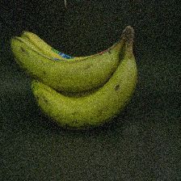
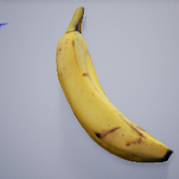

# Banana Ripeness Images Datasets

# Real Dataset Banana Images
The real dataset developed consists of 3,495 images of Cavendish bananas.



# Synthetic Dataset Banana Images
The synthetic dataset developed consists of 161,280 images of Cavendish bananas.



# anana Ripeness Classification under Varying Illumination
<div align="center">

  <!-- First row -->
  
  
  
  <br><br>

  <b>a)</b> Original &nbsp;&nbsp;
  <b>b)</b> (Γ = 0.1) &nbsp;&nbsp;
  <b>c)</b> (Γ = 0.2) &nbsp;&nbsp;
  <b>d)</b> (Γ = 0.3)

  <br><br>

  <!-- Second row -->
  
  
  
  <br><br>

  <b>e)</b> (Γ = 0.4) &nbsp;&nbsp;
  <b>f)</b> (Γ = 0.5) &nbsp;&nbsp;
  <b>g)</b> (Γ = 0.6) &nbsp;&nbsp;
  <b>h)</b> (Γ = 0.7)

  <br><br>

  <!-- Caption -->
  <i>
  Figure. Banana images showing progressive brightness enhancement as the gamma value (Γ) increases from 0.1 to 0.7, using the LIME model.
  </i>

</div>


For paper reference (Bibtex)

```
@conference{visapp23,
  author={Luis Chuquimarca. and Boris Vintimilla. and Sergio Velastin.},
  title={Banana Ripeness Level Classification Using a Simple CNN Model Trained with Real and Synthetic Datasets},
  booktitle={Proceedings of the 18th International Joint Conference on Computer Vision, Imaging and Computer Graphics Theory and Applications - Volume 5: VISAPP, (VISIGRAPP 2023)},
  year={2023},
  pages={536-543},
  publisher={SciTePress},
  organization={INSTICC},
  doi={10.5220/0011654600003417},
  isbn={978-989-758-634-7},
  issn={2184-4321},
}
```

```
@article{chuquimarca2025assessing,
  title={Assessing deep learning model robustness for banana ripeness classification under varying illumination conditions},
  author={Chuquimarca, Luis E and Vintimilla, Boris X and Velastin, Sergio A},
  journal={Smart Agricultural Technology},
  pages={101333},
  year={2025},
  publisher={Elsevier}
}
```
